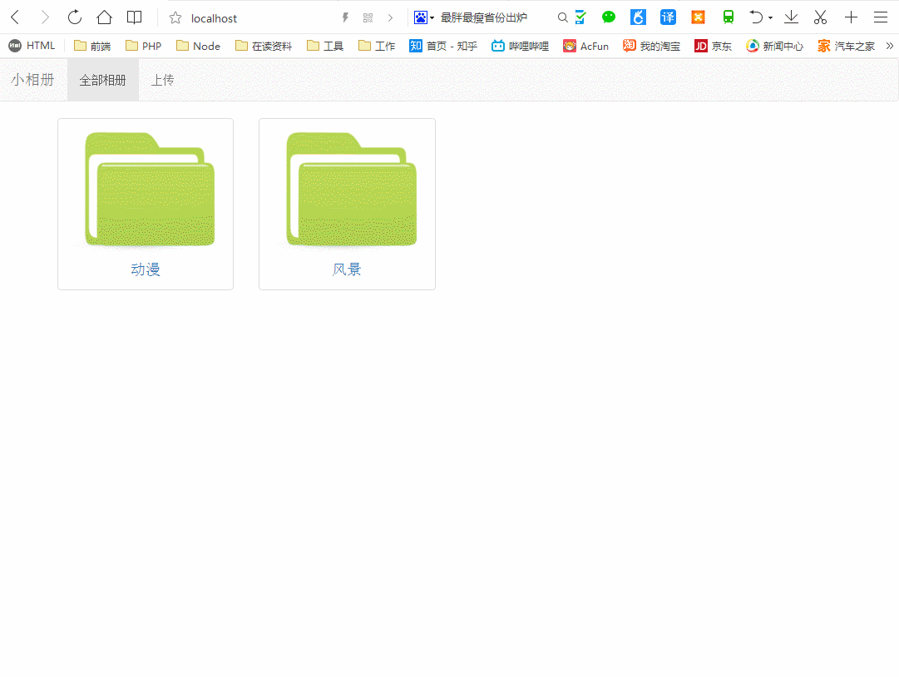

# litterAblum
### 1.nodejs使用express模块搭建的一个小相册

1. 使用了express的唯一内置的中间件 app.use(express.static("./public"));//静态资源。
2. 使用的app.get(),app.post()设置路由，其中post(),引用了的body-parser和multer(版本0.1.8，1.0以上的版本会出现错误，req.files用来获取上传的文件信息)模块来获取post传来的数据。
3. 知道了在迭代器iterator和回调方法的在多次异步函数中应用。
4. package.json的用处。
5. 前后台的交互。
 
### 2.项目结构
|__controller     //控制器        
|__models         //模型  
|__node_modules   //依赖文件夹  
|__public         //静态资源  
|__uploads        //上传文件夹  
|__views          //视图  
|__app.js         //入口文件  
|__package.json   //依赖
 
### 3.项目运行  
1. git clone git@github.com:luoanyang/littleAblum-nodejs.git
2. cd littleAblum-nodejs
3. npm install
4. node app.js
5. 浏览器打开 localhost (端口为80)

### 4.项目演示

